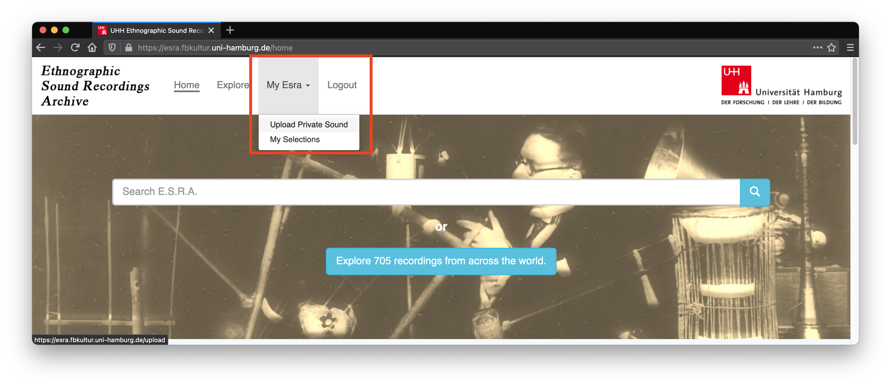
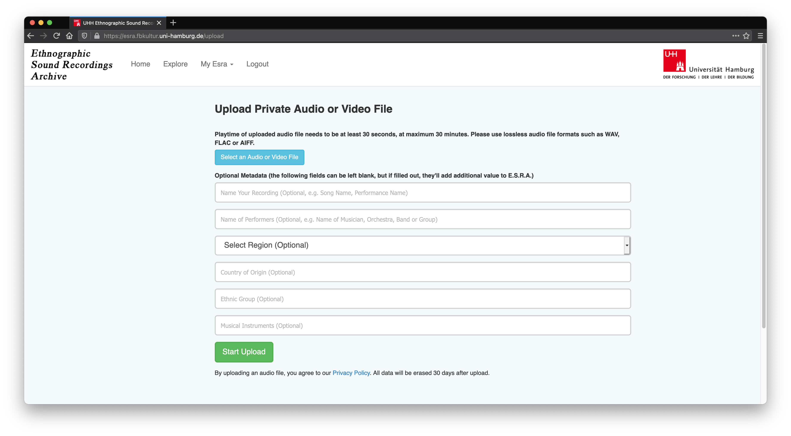

***************************************
Accessing your own archive with ESRA
***************************************

Upload to ESRA
=======================================
The easiest way to have your data analysed by ESRA is to upload it to the
online archive. To do so, head to https://esra.fbkultur.uni-hamburg.de/ and log
in. If you do not have an account yet, click on *Register* in the main
navigation on the top of the page to creat a new account.

After you have logged in, click on *My Esra* on the top of the page. In the
pop-up menu choose *Upload Private Sound*.

   Click on **My Esra** then on **Upload Private Sound** to navigate to the upload form.

You will be redirected to the upload form. Fill out the form and then click on
*Start Upload* at the bottom of the page.

   Fill out the upload form to upload sounds into ESRA. Metadata are optional.

.. note::
   All music you upload, its metadata, as well as the respective audio features
   as extracted by ESRA are private to your account. Other users cannot see or
   play your music, or access it in any other way.

Create offline SOM
======================================= 
You can also create SOMs of your music collection on your own computer. ESRA is
built upon `apollon`_, an open source framework for audio feature extraction
and music similarity estimation. A user friedly and easy to use abstraction of
the apollon's functionallity is implemented in the `comsar`_ project.  Please
visit the `comsar documentation`_ for more information on installation and
usage.

.. _apollon: https://github.com/ifsm/apollon
.. _comsar: https://github.com/ifsm/comsar

.. _comsar documentation: https://comsar.readthedocs.io/
