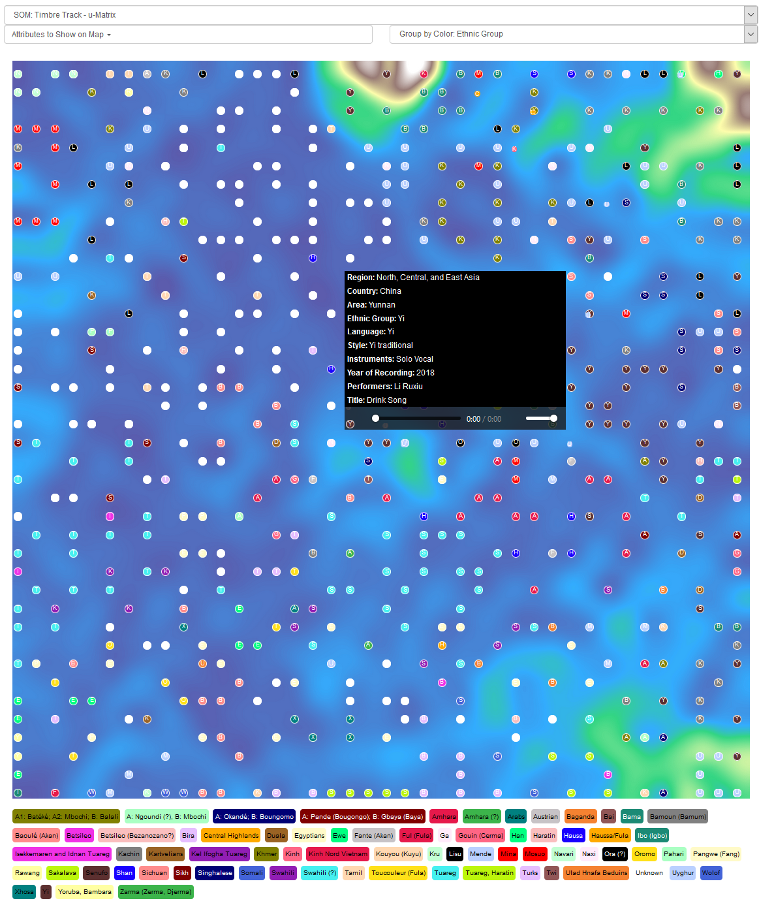

****************************************
Self-organizing maps explained
****************************************
The self-organizing map (SOM) is like a brain that has learned the musical
pieces of a collection. The ESRA SOM in ESRA is trained on all
pieces in ESRA. You can train your own SOM in the offline version.

Online, there are two trained SOMs, one for timbre and one for rhythm (for
details about the features, see sections of this manual). Pitch extraction
robustly only works for single-line melodies. As the collection at this stage
has not enough single-line melodies in all collections extracting and learning
tonal systems, melodies, or melisma is left to the offline version. Below, on
the very left top menu 'SOM Timbre Track u-Matrix' is displayed:

A trained SOM consists of neurons in a two-dimensional field. Each neuron is a
vector of all features used for training, timbre, or rhythm features.
Neigbhouring neurons might be more or less similar. This similarity is
displayed in the u-matrix, where similar regions appear dark blue and blue, and
more dissimilar regions appear green or yellow. Therefore we know that pieces
in a dark blue region are very similar to one another, while pieces separated
by a lighter ridge are more dissimilar.

The trained SOM is then used to place musical pieces on it, where each piece is
placed at the neuron, which is most similar to this piece. Therefore, the
trained SOM can be used to analyze pieces the map was not trained by, so e.g.,
new uploaded pieces from users.

The training set, here the ESRA pieces allow sorting pieces according to the
musical content in this collection. Therefore the SOM is like a person knowing
all these songs, but no others. For analysis of other musical styles or
regions, the training of a new map might be considered. This can be performed
in the offline version.

Therefore, the similarity or dissimilarity of a piece is a combination of two
factors: a) the distance on the map between the two pieces and b) the coloring
between the two pieces.

Exploring the map in terms of analyzing musical pieces in the online version is
therefore done by exploring neighboring pieces. This can be done in several
ways:

In the figure above, the pieces have colors according to ethnic groups, which
is displayed at the menu entry on the top right. At the bottom of the plot, a
legend shows the association between ethnic groups and color. The pop-up menu
shows additional metadata. Choosing one of them changes the legend and the
coloring of the pieces, respectively.

Another way of analyzing similarities is to display one or several metadata in
the map. The top left menu allows several metadata to be used, also
simultaneously. Be careful with this, the map might become too crowded:

Yet another way is to look at the metadata of single pieces on the map. Moving
the cursor over the map to a piece, the metadata of this piece pops up.
Additionally, a player is shown, which allows instantaneous playback of this
special song. It is very interesting to listen to neighboring pieces in this
way, to hear if the analyzed feature of this piece fits aural perception.

A fourth way of analyzing is to understand why the pieces are located in the
map the way they are. Below examples of timbre are shown, rhythm is
accordingly.

In the figure above, the top left menu displays 'SOM Timbre Track - Centroid
Mean'. Then only the background image changes. In this case, it displays the
strength of the spectral centroid, the perceived brightness of the songs. The
lower end of the two-dimensional plot shows dark blue regions. This means the
centroid is much higher than in the other regions. Therefore, pieces placed
here are much brighter, always compared to all other pieces on the map.

Another example below shows the standard deviation of roughness. This is
achieved by changing the menu entry on the very left top. The pieces located on
the right side have a much higher roughness standard deviation compared to the
other pieces. This does not mean that they are rougher, it does mean that
roughness over the course of the piece does change. The piece might be very
rough at some point and very soft at another.

Combining all analysis tools allows for understanding similarities,
dissimilarities, clustering, etc., of musical pieces in the collections and in
songs uploaded by users. Basically, either one is looking for clustering in
existing data, or one allows for exploring the pieces in terms of the analysis
tools to start hearing similarities one might not be aware of before.
