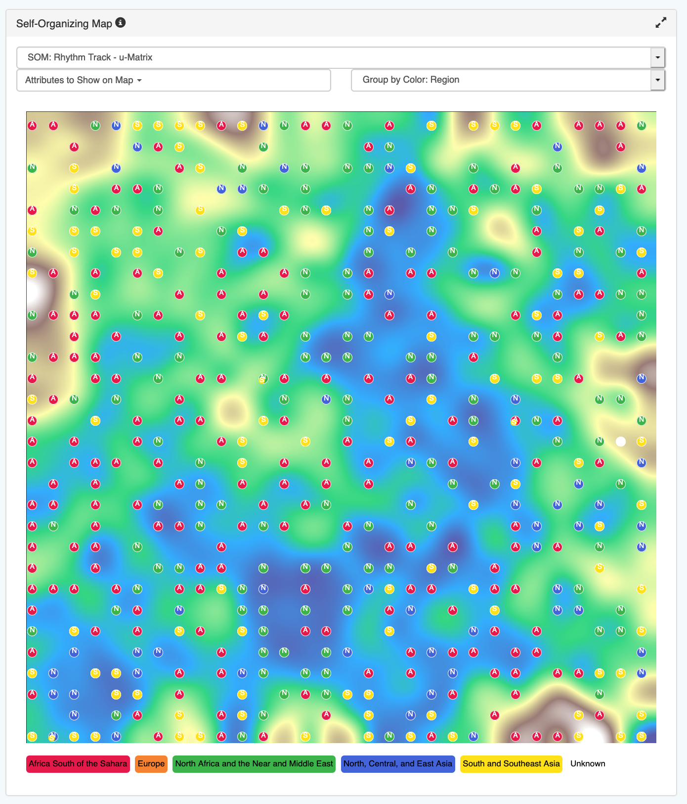
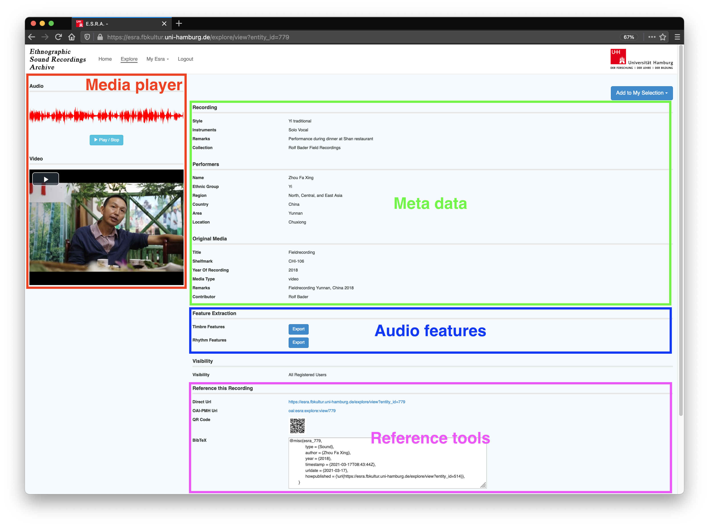
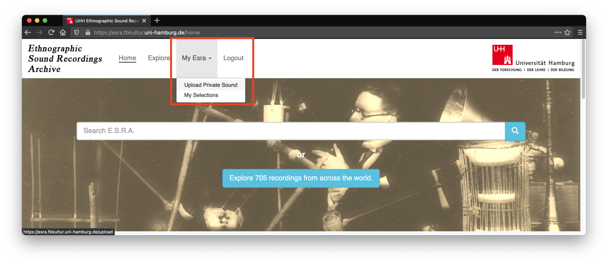
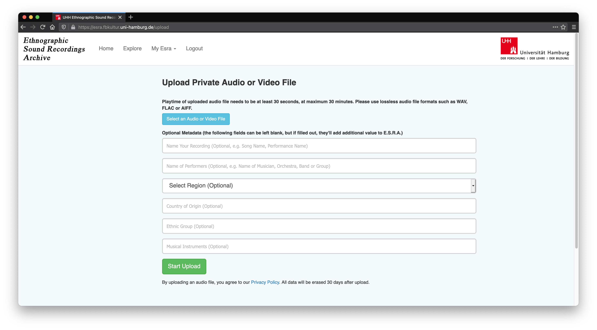

***************************************
Tutorial
***************************************

.. _tutorial-registration:

Registration
=======================================
You have to `create an ESRA account`_ to explore our audio collections and metadata. 

.. figure:: fig/firststeps/esra_register.png
   :alt: Create an ESRA account.
   :align: center 

   On the `ESRA homepage`_  click on **Register** in the top navigation bar to create an ESRA account.

.. _create an ESRA account: https://esra.fbkultur.uni-hamburg.de/register
.. _ESRA homepage: https://esra.fbkultur.uni-hamburg.de/

Home screen
=======================================
Once you are logged in you willl see the ESRA home screen. The home screen is the
starting point for every interaction with ESRA. It is subdivided into for sections

* menu bar
* meta data search 
* public collections
* footer

.. figure:: fig/tutorial/esra_home_screen.png
   :alt: ESRA home screen
   :align: center

   Sections of the ESRA home screen: menu bar, metadata search, public
   collections, and footer.

Menu bar
---------------------------------------
The Menu bar gives you direct access to the main functionallity of ESRA.  It
remains the same no matter which screen you choose. An underlined navigation
link indicates your current position within the application.

* Click on the ESRA logo or the "Home" navigation link to return to the
  HOME-Screen from anywhere.

* A click on Explore takes you to the Explore-Screen an initializes it with
  default settings.  What these settings are and how you to manipulate them
  will be explained in the Explore-Screen tutorial.

* Clicking on "My Esra" opens a subnavigation, which takes you to the personal
  account functionallity, that is, the content upload form, and the private
  selections. Both menu items will be explained in their corresponding videos.

* The Logout items securely ends your current ESRA session.

Metadata search
---------------------------------------
Below the menu bar you will find the meta data search bar. This bar enables a
common meta data search. Enter a few keywords and hit the "Return" key on your
keyboard or press the button with the magnifier glass on it. ESRA will then
search for the respective metadata in its database. The results of your query
are displayed on the explore screen. ESRA will take you there automatically.

The blue button below the meta data seach bar informs you about the number 
of records currently registred within the ESRA. Click on it to enter the
explore screen with default settings.

Explore by ...
---------------------------------------

Explore screen
========================================
The explore screen is devided into two sections: the SOM display on the left and
the query result list on the right side.

.. figure:: fig/tutorial/esra_explore_screen.png
   :alt: Screenshot of the ESRA explore screen.
   :align: center

   The right side of the explore screen list search results. Each list item is 
   also diplayed as a circle marker on the SOM disply.

Query results list
---------------------------------------
The menus on the top of the song list on the right enable to change between
different collections (middle menu), extract subcollections by regions (left
menu), or choose a selection (see below).

When searching for an item in the collection with the search text field on the
top right, all songs containing the search term in the metadata are displayed.
Below is an example of the term 'Kachin' searched for in 'Collection Bader'.
The word Kachin does not appear in all song metadata displayed. This is because
on this screen, only the most important metadata are shown:

Todo:
   * controls
   * list click

Self-organizing map display
---------------------------------------
The left side of the explore screen displays different views of the
self-organizing map.

   The SOM display in ESRA including visualization controls.

.. _tutorial-assett-detail:

Assett detail screen
========================================

   The assett detail screen includes a media player, all available metadata,
   access to audio features, and tools for referencing the selected recording.

Media player
----------------------------------------

Metadata
----------------------------------------

Audio features
----------------------------------------

Referencing
----------------------------------------

Adding assets to a selection
----------------------------------------
It is also possible to add an assett to a selection. This is interesting when
comparing the results in the SOM.  On its assett detail screen, select *Add to
my collection*. A list will open, which displays your selection. Click on a
selection name to add the current song to it. You can also create a new
selection from the same menu.

.. _tutorial-upload:

Upload music
========================================

.. important::
   ESRA supports only uncompressed formats (WAV) and lossless codecs such as
   FLAC and AIFF. Please make sure that your file meets these requirements
   before you upload.

To upload content you have to :ref:`register with ESRA<tutorial-registration>`.
After you are logged in, click on *My Esra* in the navigation bar on the top of
the page. In the pop-up menu choose *Upload
Private Sound*.

   Click on **My Esra** then on **Upload Private Sound** to navigate to the upload form.

You will be redirected to the upload form. Fill out the form and then click on
*Start Upload* at the bottom of the page.

   Fill out the upload form to upload sounds into ESRA. Metadata are optional.

.. note::
   All music you upload, its metadata, as well as the respective audio features
   as extracted by ESRA are private to your account. Other users cannot see or
   play your music, or access it in any other way.

Audio feature extraction will start immediately after the upload has completed.
Depending on the size of your file, extraction routines may take several
minutes. You can check the status of the feature extraction on the
:ref:`assett detail screen<tutorial-assett-detail>`.

.. _tutorial-selection:

Create a selection
========================================

.. _tutorial-export-features:

Export audio features
========================================
