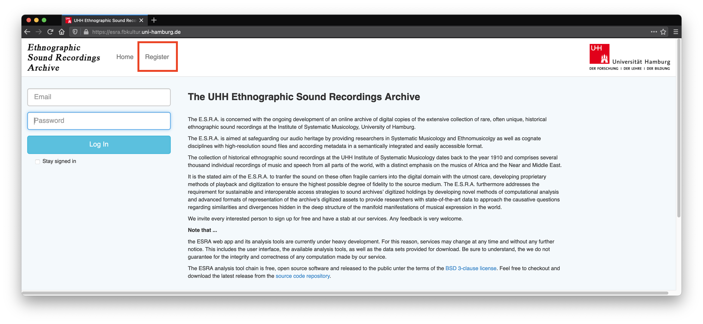
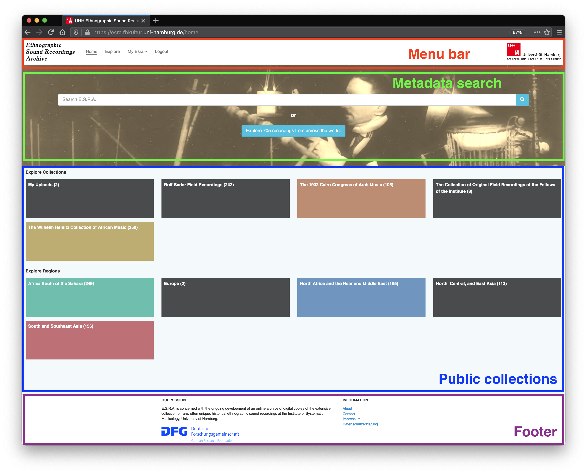
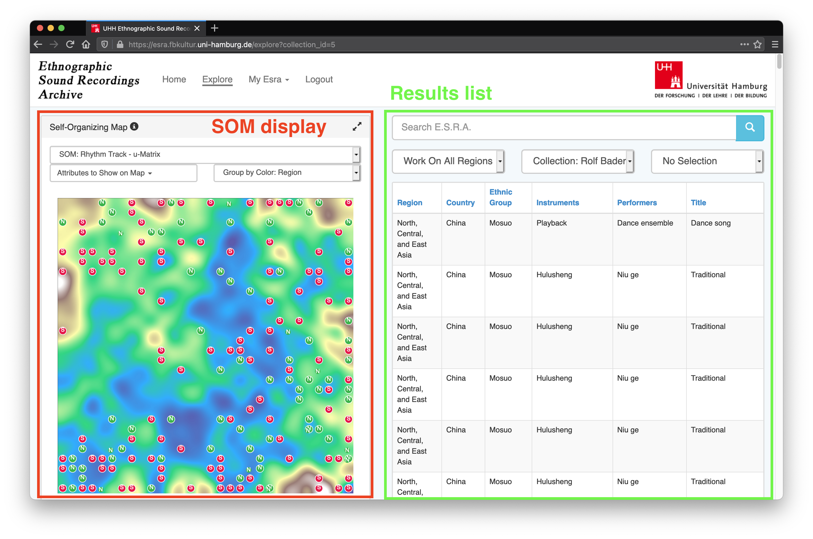
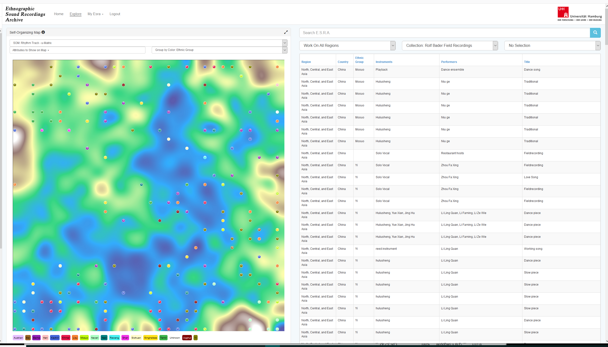
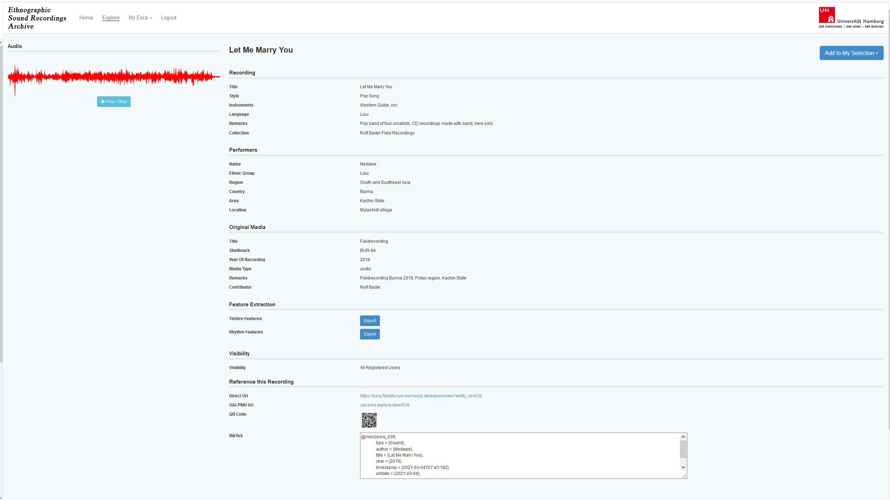
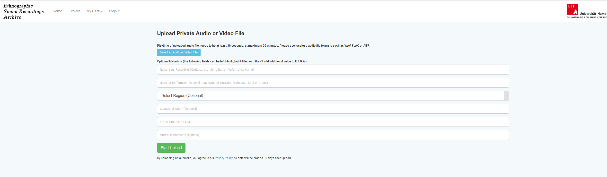
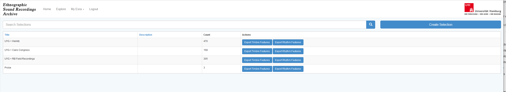

***************************************
Tutorial
***************************************

Registration
=======================================
You have to create an ESRA account to explore our audio collection and metadata. 
Thereby they declare to use the recordings and analysis results purely for academic purpose:

   On the `ESRA homepage`_  click on **Register** in the top navigation bar to create an ESRA account.

Home screen
=======================================
Once you are logged in you willl see the ESRA home screen. The home screen is the
starting point for every interaction with ESRA. It is subdivided into for sections

* menu bar
* meta data search 
* public collections
* footer

   Sections of the ESRA home screen: menu bar, metadata search, public
   collections, and footer.

Menu bar
---------------------------------------
The Menu bar gives you direct access to the main functionallity of ESRA.  It
remains the same no matter which screen you choose. An underlined navigation
link indicates your current position within the application.

* Click on the ESRA logo or the "Home" navigation link to return to the
  HOME-Screen from anywhere.

* A click on Explore takes you to the Explore-Screen an initializes it with
  default settings.  What these settings are and how you to manipulate them
  will be explained in the Explore-Screen tutorial.

* Clicking on "My Esra" opens a subnavigation, which takes you to the personal
  account functionallity, that is, the content upload form, and the private
  selections. Both menu items will be explained in their corresponding videos.

* The Logout items securely ends your current ESRA session.

Metadata search
---------------------------------------
Below the menu bar you will find the meta data search bar. This bar enables a
common meta data search.  Enter a few keywords and hit the "Return" key on your
keyboard or press the button with the magnifier glass on it. ESRA will then
search for the respective metadata in its data base. The results of your query
are displayed on the explore screen. ESRA will take you there automatically.

The blue button below the meta data seach bar informs you about the number 
of records currently registred within the ESRA. Click on it to enter the
explore screen with default settings.

Public collections
---------------------------------------

Explore screen
=======================================
The explore screen is devided into two sections: the SOM display on the left and
the results list on the right side.

   The right side of the explore screen list search results. Each list item is 
   also diplayed as a circle marker on the SOM disply.

Query results list
---------------------------------------

Self-organizing map display
---------------------------------------

Kohonen self-organizing map (SOM) is shown on the left, discussed below. On the
right, the songs in the collection are shown with metadata:

The menus on the top of the song list on the right enable to change between
different collections (middle menu), extract subcollections by regions (left
menu), or choose a selection (see below).

When searching for an item in the collection with the search text field on the
top right, all songs containing the search term in the metadata are displayed.
Below is an example of the term 'Kachin' searched for in 'Collection Bader'.
The word Kachin does not appear in all song metadata displayed. This is because
on this screen, only the most important metadata are shown:

.. figure:: fig/ESRA_search.png
   :scale: 50 %
   :alt: ESRA search

In this example, when clicking on the top entry of the song list, the whole metadata are displayed:

On the top left, the song can be played. If the song also contains a video, the
video can be viewed. On the very right top, this song can be added to a
selection a user decides to create (see below). In the middle-lower section
'Feature Extraction', the extracted featues of the song can be exported as a
.csv file. This can be used in the COMSAR offline version or any other
postprocessing software (for details, see Offline jupyter notebook version).

In the top menu, in 'My ESRA', choosing 'Upload Private Sound', users can
upload audio or video files. At the moment, ESRA only accepts audio files with
a sample rate of 44.1 kHz (CD quality). After filling out the metadata fields,
the song can be uploaded. COMSAR instantaneously starts analyzing the song.
This might take a few minutes. The uploaded songs by a user are only visible
and audible to this user. If one wishes to make songs publicly available for
others, please contact us. Also, if you have a large collection of songs, it
might be good to contact us too. We provide you with an excel file where you
can insert all metadata of all songs at once.

When songs are uploaded, they can be included in a new selection created by the
user (and again only visible to this user):

In the metadata field shown above, one can add single songs to this collection,
also adding songs from ESRA collections. This is interesting when comparing the
results in the SOM. Again, if you have many songs to add to one collection, you
can contact us.

.. _ESRA homepage: https://esra.fbkultur.uni-hamburg.de/
